# AI-Powered-Customer-Retention-Prediction-System
The goal of this project is to analyze customer data from a telecommunications company to predict whether a customer will churn (leave the service) or stay.

🔗 **Live Web App**: https://ai-powered-customer-retention-prediction-3tyr.onrender.com

---
### Objective
This project is a machine learning-based solution designed to predict customer churn for telecom partners (Jio, Airtel, BSNL, Vodafone). By identifying at-risk customers, the system enables businesses to implement proactive retention strategies, ultimately reducing revenue loss.

---

###  Dataset Description
- **Rows**: 7,043  
- **Columns**: 21  
- **Source**: [Telco Customer Churn Dataset (Kaggle)](https://www.kaggle.com/datasets/blastchar/telco-customer-churn)  
---
**Features:**
- **Demographics**: Gender, Senior Citizen, Partner, Dependents  
- **Services**: Phone, Internet, Online Security, Tech Support, Streaming  
- **Account & Billing**: Tenure, Contract type, Payment method, Monthly charges, Total charges  
- **Target Variable**: `Churn` (Yes/No)  
---
### Tools & Technologies
- **Python**  
- **Pandas** – Data loading & cleaning  
- **Matplotlib & Seaborn** – Visualization  
- **Logging Module** – Workflow tracking & error handling
- ---
- ### Feature Augmentation
- Added a synthetic variable: **Telecom Partner (Jio, Airtel, BSNL, Vodafone)**.  
- Random assignment ensures balanced demographics across partners.  
- Simulates competitive market conditions for deeper analysis.  
---
##  Step 1: Exploratory Data Analysis (EDA)
###  Visualizations & Insights
## 1️ Churn Distribution
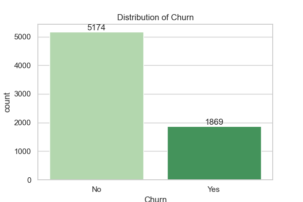
- **Graph**: Bar Chart (countplot)  
- **Values**: No = 5,174 | Yes = 1,869  
- **Observation**: Majority of customers did not churn.  
- **Insight**: Dataset shows **data imbalance** → need metrics beyond accuracy (Precision, Recall, F1).  

---

## 2️ Telecom Partner vs Gender
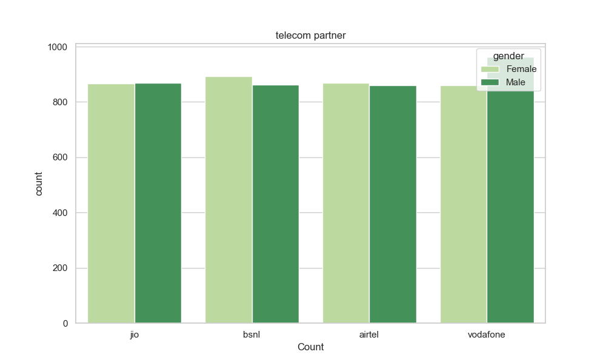
- **Graph**: Bar Chart (countplot)  
- **Values**: Even distribution across partners.  
- **Observation**: Male/Female counts are balanced for each partner.  
- **Insight**: Confirms synthetic partner assignment worked → fair test environment.  

---

## 3️ Senior Citizen in Telecom Partner
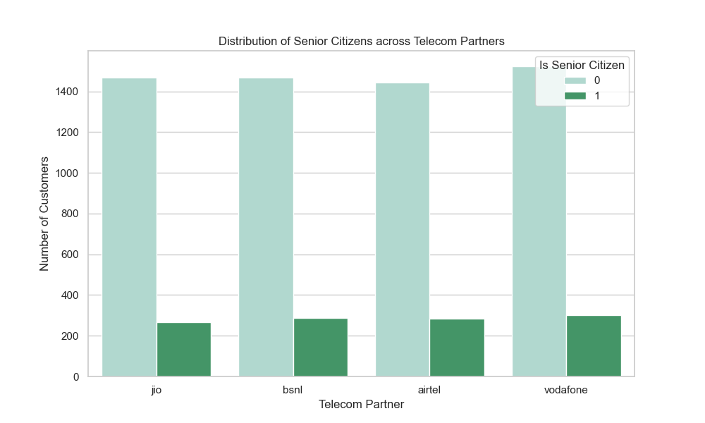
- **Graph**: Bar Chart (countplot)  
- **Values**: Non-Seniors ≈ 1,450 per partner | Seniors ≈ 280 per partner.  
- **Observation**: Ratio of young to old consistent across partners.  
- **Insight**: If churn differs later, it’s due to service quality, not demographics.  

---

## 4️ Gender Distribution
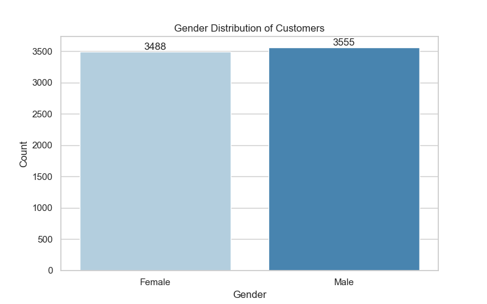
- **Graph**: Bar Chart (countplot)  
- **Values**: Male = 3,555 | Female = 3,488  
- **Observation**: Customer base is nearly 50/50.  
- **Insight**: Balanced dataset → no gender bias in churn analysis.  

---

## 5️ Gender vs Churn
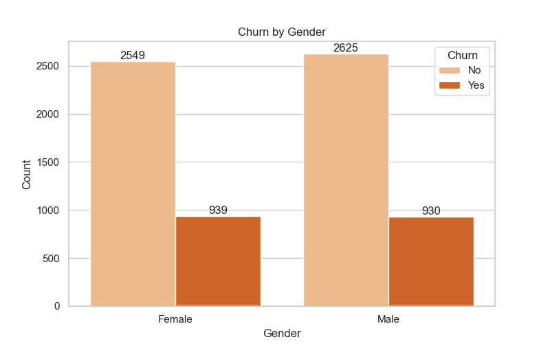
- **Graph**: Bar Chart (countplot)  
- **Values**: Female (No = 2,549, Yes = 939) | Male (No = 2,625, Yes = 930)  
- **Observation**: Churn is nearly identical for both genders.  
- **Insight**: Gender is **not a churn driver**.  

---

## 6️ Gender Breakdown (No Internet Service)
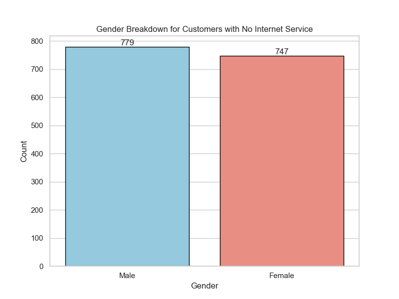
- **Graph**: Bar Chart (countplot with query)  
- **Values**: Female = 747 | Male = 779  
- **Observation**: Equal split in “Basic Phone Only” segment.  
- **Insight**: Legacy users retention depends on call reliability & basic plan costs.  

---

## 7️ Tenure vs Churn
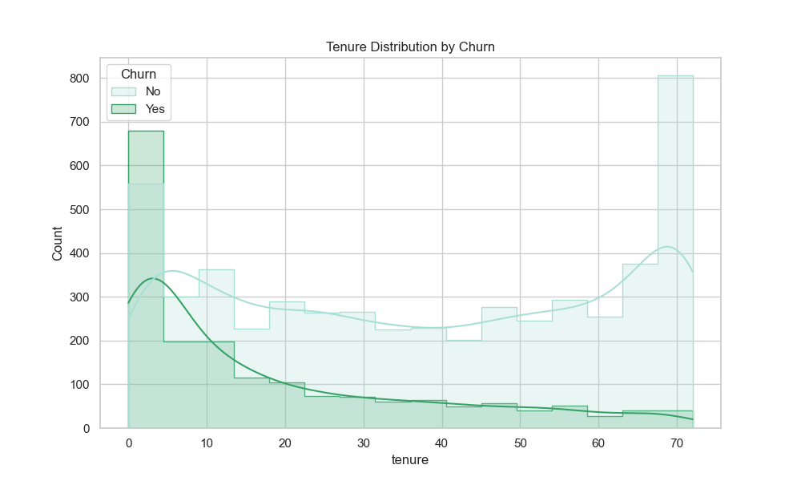
- **Graph**: Histogram with KDE (histplot)  
- **Values**: Stayed avg. = 37.5 months | Churned avg. = 17.9 months  
- **Observation**: Customers churn early (within 1.5 years).  
- **Insight**: First year is the **danger zone** → onboarding & loyalty rewards critical.  

---

## 8️ Contract Type vs Churn
 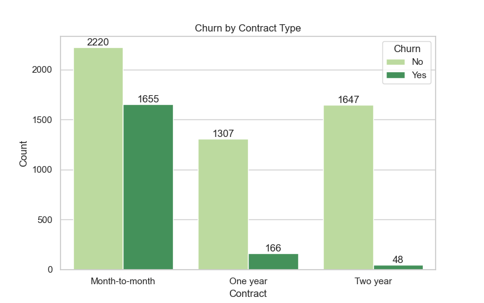
- **Graph**: Bar Chart (barplot)  
- **Values**:  
  - Month-to-month: No = 2,220 | Yes = 1,655  
  - One year: No = 1,307 | Yes = 166  
  - Two year: No = 1,647 | Yes = 48  
- **Observation**: Month-to-month contracts show highest churn.  
- **Insight**: **Contract length is a key retention driver**.  

---

## 9️ Internet Service vs Churn
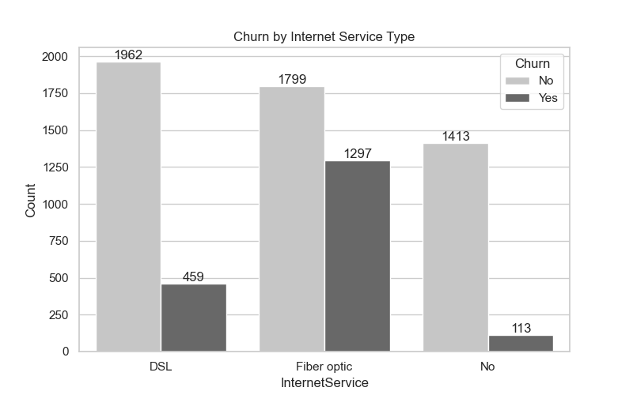
- **Graph**: Bar Chart (barplot)  
- **Values**:  
  - DSL: No = 1,962 | Yes = 459  
  - Fiber optic: No = 1,799 | Yes = 1,297  
  - No Internet: No = 1,413 | Yes = 113  
- **Observation**: Fiber optic users churn more.  
- **Insight**: Premium service dissatisfaction → needs audit.  

---

## 10 Payment Method vs Churn
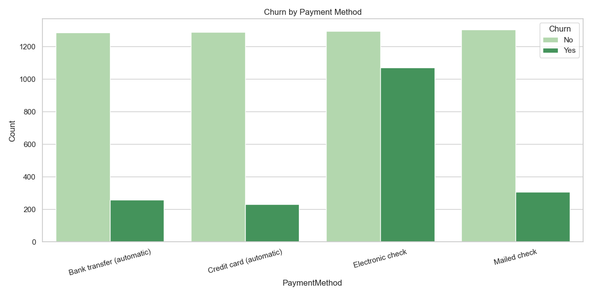
- **Graph**: Bar Chart (barplot)  
- **Values**:  
  - Bank transfer (auto): No = 1,286 | Yes = 258  
  - Credit card (auto): No = 1,290 | Yes = 232  
  - Electronic check: No = 1,294 | Yes = 1,071  
  - Mailed check: No = 1,304 | Yes = 308  
- **Observation**: Electronic check users churn most.  
- **Insight**: Auto-pay reduces churn → encourage adoption.  

---

## 1️1️ Senior Citizen vs Churn
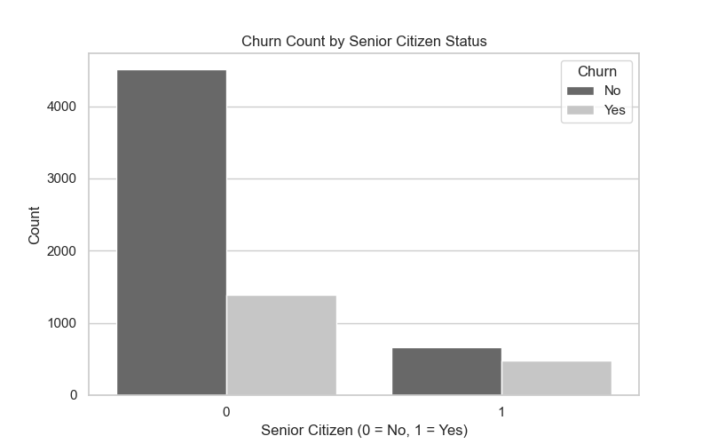
- **Graph**: Bar Chart (countplot)  
- **Values**:  
  - Non-Seniors: No = 4,508 | Yes = 1,393  
  - Seniors: No = 666 | Yes = 476  
- **Observation**: Seniors churn at higher rates.  
- **Insight**: Senior-friendly support & billing could improve retention.

- ---
## 12. Senior Citizen Distribution by Gender
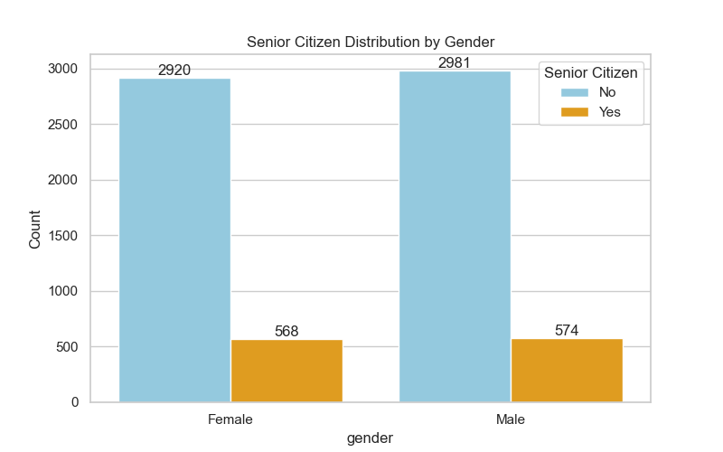 
- **Graph**: Bar Chart (countplot) 
- **Values**: 
  Gender  Non‑Senior(0) | Senior(1) 
- Female  2,920      |     568        
- Male    2,981     |      574  

**Observation:** Balanced distribution of senior citizens across genders.  
**Insight:** Useful for targeted retention campaigns.

## EDA Conclusion
- Month-to-month plans → massive churn.  
- High monthly bills → churn trigger.  
- Electronic checks → highest churn risk.  
- Senior citizens → vulnerable group.  
- Gender → not a churn driver.  
- Fiber optic users → churn more than DSL.  

✅ Step 1 completed: dataset is now ready for **feature engineering & model building**.

##  Step 2: feature selection and feature engineering
## 2.1 Automated Imputation Selection Module
## 📌 Overview
The missing_value function acts as a "tournament" runner. For every column containing missing data, it tests multiple imputation strategies and selects the one that results in the least variance distortion (for numeric data) or successfully fills all records (for categorical data).

## ⚙️ Core Components
IMPUTE_DATA Class
This class contains the underlying engines for data filling. It wraps Scikit-Learn and Pandas methods to ensure consistent behavior across training and testing sets.

- mean_impute: Replaces missing numeric values with the column mean.

- median_impute: Replaces missing numeric values with the column median.

- mode_impute: Replaces missing values (numeric or categorical) with the most frequent value.

- forward_fill / backward_fill: Uses the previous or next valid observation to fill the gap.

- random_sample_impute: Replaces missing values with a random observation from the non-null values of the same column.

## 2.2 Automated Variable Transformation Module
## 📌 Overview
The variable_transform method implements an automated "best-fit" logic. For every numerical column, it tests eight different scaling and transformation methods and chooses the one that brings the column's skewness closest to zero.
## ⚙️ Core Components
- Standard Scaling: Shifts the mean to 0 and variance to 1; best for algorithms assuming Gaussian (normal) data.
- Min-Max Scaling: Rescales data to a fixed range (usually 0 to 1); best when the distribution is not Gaussian.
- Robust Scaling: Scales data using the median and quartiles; best for datasets with many outliers.
- Log Transform: Applies $log(1+x)$ to the feature; best for highly right-skewed data.
- Box-Cox: A power transform to make data more normal-like; strictly requires positive data ($>0$).
- Yeo-Johnson: Similar to Box-Cox but supports zero and negative values; a general-purpose normality transform.
- Quantile Transform: Maps data to a normal distribution using quantiles; best for collapsing outliers and non-linear patterns.

## The Selection Logic (variable_transform method)
The logic operates by segmenting the data and running a competitive evaluation:

- Data Split: Separates numerical and categorical columns.

- Tournament Loop: For each numerical column, it applies all eight techniques.

- Skewness Scoring: It calculates the absolute skewness of the resulting training column using abs(skew(...)).

- Selection: The technique resulting in the skewness value closest to 0 is selected as the "winner."

- Application: The winning transformation is applied to both X_train and X_test (fitting only on the training set).

## 2.3 Automated Outlier Handling Module
## 📌 Overview
The outlier_handling method iterates through every numerical column and tests multiple statistical treatments. It selects the "winning" technique based on which method results in the lowest absolute skewness, ensuring the data remains as close to a normal distribution as possible while removing extreme values.

## ⚙️ Core Components
## Outlier_handling Class
This class contains the statistical engines used to cap, scale, or transform extreme values.
- IQR Method: Clips values outside the Interquartile Range ($Q1 - 1.5 \times IQR$ to $Q3 + 1.5 \times IQR$).
- Z-Score Method: Caps data at 3 standard deviations from the mean.
- Winsorization: Caps extreme values at the 5th and 95th percentiles.
- Clipping: A more conservative cap, targeting the 1st and 99th percentiles.
- Log Outlier: Applies a log transformation to compress the range of outliers.
- Robust Scaling: Scales features using the median and IQR, making them resilient to remaining outliers.
## Visual Validation and Logging
- Plot Comparison: For every column, the module generates a side-by-side boxplot comparison ("Before" vs. "After") and saves it to a plot_outliers directory.

- Audit Trail: It logs the specific file path for every visual check and generates a summary table using the tabulate library to show the best method selected for each column.

## 2.4 Automated Categorical Encoding Module
## 📌 Overview
The cat_to_num function separates categorical features from numerical ones and tests five distinct encoding strategies. For every categorical column, it evaluates which technique produces the fewest number of features while successfully transforming the data.
## ⚙️ Core Components
## CAT_TO_NUM Class
This class contains five primary encoding engines:

- Label Encoding: Assigns a unique integer to each category; best for simple categories where order doesn't matter.

- One-Hot Encoding: Creates binary columns for each category; best for nominal data with few unique values.

= Frequency Encoding: Replaces categories with their count or frequency in the training set.

- Binary Encoding: Converts categories to binary code and splits them into multiple columns; efficient for high-cardinality features.

- Ordinal Encoding: Manually maps categories to a specific hierarchical order (e.g., 'Month-to-month' < 'One year' < 'Two year').

## 2.5 Automated Feature Selection Module
## 📌 Overview
The fs function implements a "best-of" tournament for dimensionality reduction. It tests four distinct statistical and machine learning-based selection strategies and automatically chooses the one that produces the most compact feature set (minimum number of features) without losing essential data.
## ⚙️ Core Components
## FEATURE_SELECTION Class
This class contains the underlying logic for four different selection methodologies:
- Low Variance Filter (drop_low_variance): Removes constant or near-constant features that provide little to no predictive information based on a variance threshold.
- Correlation Filter (drop_redundant_features): Identifies and drops features that are highly correlated with each other (multicollinearity), as they provide redundant information.
- Select K-Best (select_top_features): Uses statistical tests ($F$-tests) to rank features based on their individual relationship with the target variable ($y$) and picks the top $k$ performers.
- Random Forest Importance (select_by_importance): Trains an ensemble model to calculate "feature importance" scores and keeps only those features that contribute more than the average feature to the model's decision-making.

## 2.6 Automated Data Balancing Module
## 📌 Overview
The data_balance method treats different balancing strategies as competitors. It tests six distinct over-sampling, under-sampling, and hybrid techniques on a numeric subset of your data. The method that achieves the highest cross-validated F1-score is declared the winner and applied to the full dataset.
## ⚙️ Core Components
## DATA_BALANCE Class
This class houses various resampling algorithms from the imblearn library:

- SMOTE (Synthetic Minority Over-sampling Technique): Creates synthetic examples of the minority class by interpolating between existing points.

- Random Over Sampler (ROS): Randomly duplicates existing samples from the minority class until classes are balanced.

- Random Under Sampler (RUS): Randomly removes samples from the majority class to match the minority class size.

- ADASYN: Similar to SMOTE but focuses on generating synthetic samples in "hard to learn" regions where density is low.

- Hybrid Methods (SMOTE-Tomek & SMOTE-ENN): Combines over-sampling of the minority class with under-sampling (cleaning) of the majority class to create clearer decision boundaries.

## 2.7 Automated Feature Scaling Module
## 📌 Overview
The feature_scaling method identifies the "best" scaler for your dataset by testing multiple techniques against a baseline Logistic Regression model. The selection is based on the highest cross-validated F1-score, ensuring the chosen scaling method best prepares the data for model learning.
## ⚙️ Core Components
## Supported Scalers
The module evaluates five industry-standard scaling techniques:

- Standard Scaler: Standardizes features by removing the mean and scaling to unit variance.

- Min-Max Scaler: Transforms features by scaling each feature to a specific range (typically 0 to 1).

- Robust Scaler: Scales features using statistics that are robust to outliers (median and interquartile range).

- Max-Abs Scaler: Scales each feature by its maximum absolute value; ideal for sparse data.

- Normalizer: Rescales each sample (row) individually to have a unit norm.
 ## The Selection Logic
The function follows a systematic evaluation pipeline:

- Numerical Filtering: Automatically isolates numerical columns to prevent crashes from categorical data (e.g., strings).

- Tournament Evaluation: Each scaler is fitted and transformed on the training data.

- Performance Scoring: A Logistic Regression model is trained on the scaled data using 3-fold cross-validation to calculate the F1-score.

- Winner Selection: The scaler with the highest F1-score is chosen.

- Persistence: The winning scaler object is saved as a scaler_path.pkl file for future use in production or inference.

## 3 Model Evaluation & Selection Module
## 📌 Overview
The common function executes a full-scale competition among nine different machine learning models. Each model is trained and evaluated using Accuracy and ROC-AUC scores. The module automatically identifies the "best" model based on the highest Area Under the Curve (AUC) and exports it for production use.
## Supported Models
The module evaluates a wide range of algorithms, from simple linear models to complex ensembles:
- KNN (K-Neighbors Classifier): Predicts based on the majority class of the nearest 5 neighbors.
- Naive Bayes (GaussianNB): A probabilistic classifier based on Bayes' theorem.
- Logistic Regression: Includes automated Hyperparameter Tuning via GridSearchCV to find the optimal $C$, penalty, and solver.
- Decision Tree: Uses 'entropy' as the criterion to build a single tree.Random Forest: An ensemble of 5 decision trees.
- Ensemble Boosting: Includes AdaBoost (using Logistic Regression as the base), Gradient Boosting, and XGBoost.
- SVM (Support Vector Machine): Uses a Radial Basis Function (RBF) kernel to handle non-linear data.

## 📊 Model Comparison (Ranked by ROC-AUC)
 The following table summarizes how each algorithm performed, sorted by their ability to distinguish between classes (ROC-AUC):
 Model               ROC-AUCScore    Test Accuracy
 Logistic Regression   0.8394          0.8077 
 Gradient Boosting     0.8287          0.7644
 XGBoost               0.8207          0.7828 
 AdaBoost              0.8016          0.7551
 KNN                   0.7812          0.7736 
 Naive Bayes           0.7812          0.7878 
 Random Forest         0.7630          0.7587 
 SVM                   0.6730          0.7991 
 Decision Tree         0.6692          0.7324 

## 🏆 Best Performing Model

- Winner: Logistic Regression was selected as the best model.

- Best ROC-AUC: 0.8394.

- Best Accuracy: 0.8077.

- Status: The model was successfully saved as Churn_Prediction_Best_Model.pkl.
## Evaluation Logic
The module performs a rigorous assessment of each model:

- Training: Fits each model on the training data.

- Metrics Calculation: Logs the test accuracy and, for Logistic Regression, the ROC-AUC score.

- Visual Validation: Generates an ROC Curve plot that overlays the performance of all models for visual comparison.

- Model Selection: Compares the roc_auc_score of every model and logs the "BEST MODEL."

- Persistence: Automatically saves the winning model object as Churn_Prediction_Best_Model.pkl using pickle.

## 💻 Web Application (Flask)
The system includes a production-ready web interface (app.py) that allows users to input customer details and receive an instant retention prediction.

- Frontend: Built with HTML5 and CSS3 (index.html), featuring a responsive grid layout for 20 unique customer features.

- Backend: A Flask server handles POST requests, processes raw input into DataFrames, and performs real-time label encoding.

- Model Integration: Uses serialized model.pkl and scaler.pkl files (Standard Scaler) to ensure consistency between training and production environments.

## 🔧 Installation & Usage
- Clone the repository:
`git clone https://github.com/yourusername/customer-retention-system.git`
- Install dependencies:
`pip install -r requirements.txt`
- Run the Web App:
`python app.py`

## 🧪 How to Use the Application
Visit the deployed app:

 https://ai-powered-customer-retention-prediction-3tyr.onrender.com 

Enter customer details such as:

Telecom Partner

Gender

Senior Citizen (0=No, 1=Yes)

Tenure (Months)

Partner

Dependents

Internet Service

Contract

Monthly Charges

Total Charges

Payment Method

Tech Support

Click Predict Rentention Status to view churn prediction results

## 💡 Key Technical Details
- Global Access: Models are stored as global variables (e.g., global knn_reg) to ensure they can be accessed easily within the comparison function.
- Probability Prediction: For most models, the module uses predict_proba to calculate the True Positive Rate (TPR) and False Positive Rate (FPR) needed for the ROC Curve.
- Grid Search: The Logistic Regression model is specifically tuned across multiple parameters ($C$: 0.01 to 100) to ensure it performs at its peak before the final comparison.
- Error Handling: Every model training block is wrapped in a try-except block to ensure that if one model fails to converge, the rest of the competition can still proceed.

